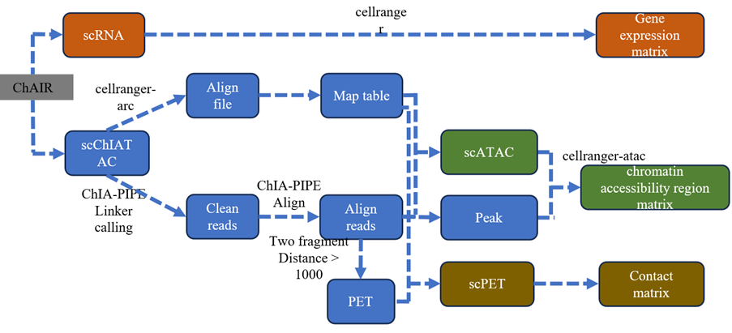
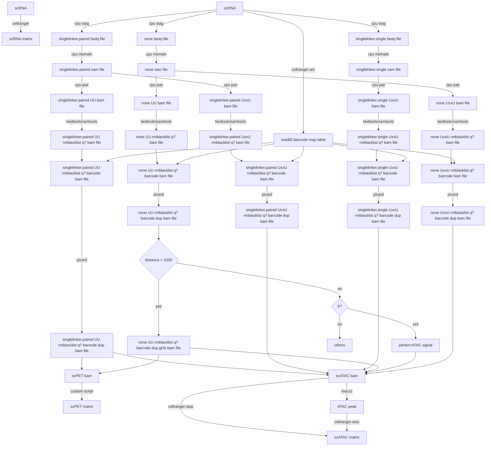

# ChIAIR-PIPE
Program for ChAIR data analysis





# REQUIREMENT
```
ChIAPET-pipeline (https://github.com/TheJacksonLaboratory/ChIA-PIPE)
MACS v2.2.7.1
BEDTools v2.27.1
SAMTools v1.9
DeepTools v3.5.1
Juicer tools 1.22.01 
HiCRep Python version https://github.com/dejunlin/hicrep
HiCExplorer v3.5
hisat v2.1.0 
htseq-count v0.13.5
R 3.5.2
Seurat 4.3.0
Signac 1.10.0
harmony 0.1.1
DoubletFinder 2.0.3
cellranger 6.0.0
cellranger-arc 2.0.2
cellranger-atac 2.1.0
dip-c: https://github.com/tanlongzhi/dip-c
Nucdynamic: https://github.com/tjs23/nuc_dynamics
CrossMap v0.6.1
monocle3 1.3.5
bwa 0.7.17
bcftools 1.17
ucsc_kentUtils: https://hgdownload.soe.ucsc.edu/admin/exe/linux.x86_64/
singularity 3.8.5-2.el7
Picard
BandNorm
Dip-c
Nuc
CtG

Python
R
Perl

Slurm
```
Some of the software we use is the singularity version. The following four software can be downloaded from Baidu.com (https://pan.baidu.com/s/1KKC0DJ43wuuCdPwr09dgCg?pwd=bj2p   Password: bj2p)
```
cellranger_6.0.0.sif
cpu0.0.1a-r2.sumner.sif
GATK_latest.sif
juicer_1.22.01.sif
```
```
cp cellranger_6.0.0.sif cpu0.0.1a-r2.sumner.sif GATK_latest.sif juicer_1.22.01.sif singularity
```

# USAGE
```
1. Download data from CNCB (https://www.cncb.ac.cn/)
2. Changing the file name to match cellranger's requirements
3. download the reference index from 10xgenomics (for cellranger/cellranger-arc/cellranger-atac)
4. bash submit_cpu10x_for_scChiatac.mm10.nobl.sh SCG0192_GT22-15872_SI-NA-D6.fastq.prefix > SCG0192_GT22-15872_SI-NA-D6.fastq.prefix.log 2>SCG0192_GT22-15872_SI-NA-D6.fastq.prefix.log.run.sh
```

# EXAMPLE
```
step1-2:
wget https://download.cncb.ac.cn/gsa-human/HRA007068/HRR1686121/HRR1686121.tar.gz # DNA
wget https://download.cncb.ac.cn/gsa-human/HRA007068/HRR1686122/HRR1686122.tar.gz # RNA
tar zxf HRR1686121.tar.gz 
tar zxf HRR1686122.tar.gz

mv K562_Rep1.DNA.R1_001.fastq.gz SCG0074-15872_SI-NA-D6_S5_L003_R1_001.fastq.gz
mv K562_Rep1.DNA.R2_001.fastq.gz SCG0074-15872_SI-NA-D6_S5_L003_R2_001.fastq.gz
mv K562_Rep1.DNA.R3_001.fastq.gz SCG0074-15872_SI-NA-D6_S5_L003_R3_001.fastq.gz
mv K562_Rep1.RNA.R1_001.fastq.gz SCG0081-15878_GTAACATGCG-AGGTAACACT_S1_L001_R1_001.fastq.gz
mv K562_Rep1.RNA.R2_001.fastq.gz SCG0081-15878_GTAACATGCG-AGGTAACACT_S1_L001_R2_001.fastq.gz

step3:
# https://www.10xgenomics.com/support/software/cell-ranger/downloads#reference-downloads
wget https://cf.10xgenomics.com/supp/cell-exp/refdata-gex-GRCh38-2024-A.tar.gz
tar zxf refdata-gex-GRCh38-2024-A.tar.gz

# https://www.10xgenomics.com/support/software/cell-ranger-arc/downloads#reference-downloads
wget https://cf.10xgenomics.com/supp/cell-arc/refdata-cellranger-arc-GRCh38-2024-A.tar.gz
tar zxf refdata-cellranger-arc-GRCh38-2024-A.tar.gz

step4:
# change the parameter in submit_cpu10x_for_scChiatac.mm10.nobl.sh script：
export genome=hg38 # hg38
export ARCref=$abspath/refdata-cellranger-arc-GRCh38-2024-A # arc genome ref
export GEXref=$abspath/refdata-gex-GRCh38-2024-A # gex genome ref
fasta=hg38.fa # with hg38 bwa index

# edit a input file: k562.SCG0074.fastq.prefix
$abspath/SCG0074-15872_SI-NA-D6	$abspath/SCG0081-15878_GTAACATGCG-AGGTAACACT # No blank line breaks

bash submit_cpu10x_for_scChiatac.mm10.nobl.sh k562.SCG0074.fastq.prefix > k562.SCG0074.fastq.prefix.log 2>k562.SCG0074.fastq.prefix.log.run.sh
```

# CONTACT
黄星宇 (Xingyu Huang, xingyu.huang@zju.edu.cn/huang182@live.cn)